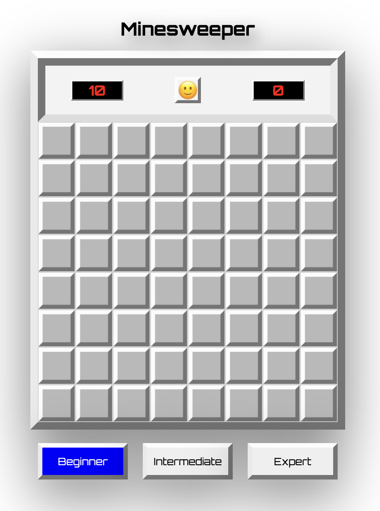
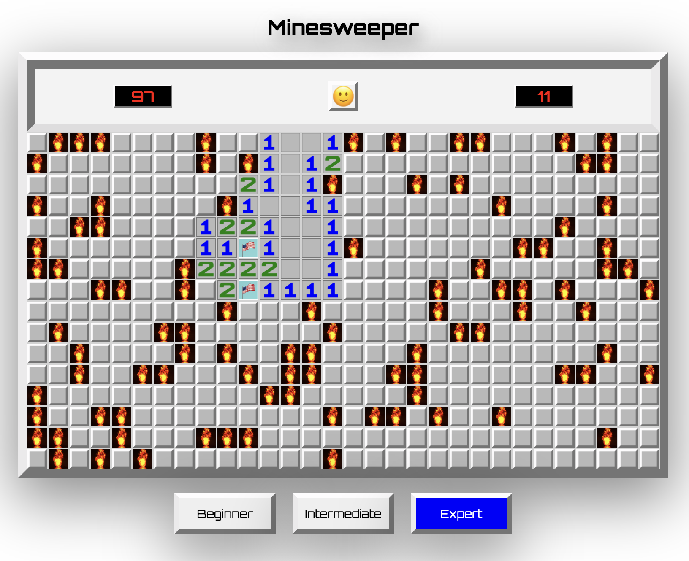
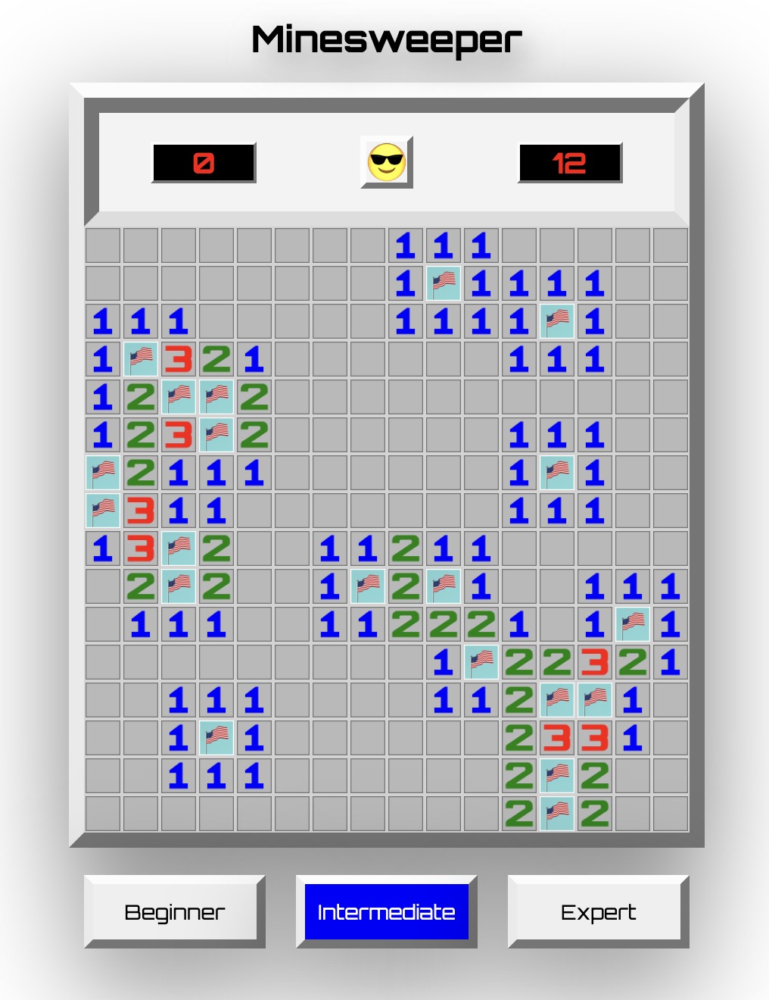

# Project 1: Minesweeper

---
### Overview
---
This project is my first fully developed exercise at General Assembly's Software Immersive course.

The assignment was to create a grid-based game that could utilise array-based logic, moving parts and variable difficulty settings to be rendered in the browser, using HTML, CSS and JavaScript. The project deadline was to be completed individually, within one week.

I chose to create  Minesweeper because it was my favorite computer game growing up, and it was one of the highest-difficulty games we were presented. The interface is quite simple, so I won't discuss CSS or HTML very in-depth, but the JavaScript logic is fairly complex, so in this document I'll guide you through it.

Are you curious to see the end result? [Check out the demo.](https://psopher.github.io/Minesweeper/) 

---
### Brief
---
* Render a game in the browser.
* Design a logic for the gameplay, player scoring, levels and game end.
* Include separate HTML / CSS / JavaScript files.
* Stick with KISS (Keep It Simple Stupid) and DRY (Don't Repeat Yourself) principles.
* Use JavaScript for DOM manipulation and game logic.
* Deploy the game online.
* Use semantic markup for HTML and CSS.

---
### Technologies Used
---
* HTML
* CSS
* JavaScript
* Git and GitHub
* Google Fonts

---
### Approach
---

#### Grid Layout
The is populated inside an empty HTML container div. The beginner grid is 8x8 with 10 mines, the intermediate grid is 16x16 with 20 mines, and the expert grid is 30x16 with 99 mines. Inside a for loop, the grid is created by appending a number of child divs equal to the cell count of the specified level (64 for beginner, 256 for intermediate, and 480 for expert)


#### Global Variables
From the beginning it was important to create global variables. I used: 
* both string and numerical level indicators to keep track of the level that the user selected
* A timer count and a timer interval
* A boolean that keeps track of whether the game has finished, and a seperate boolean that keeps track of whether the mines have shown (after a player loses)
* 4 arrays:
  - One that keeps track of the indexes of the cells that contain the mines
  - One that keeps track of the indexes of the cells that have been opened
  - One that keeps track of the indexes of the cells that have been flagged
  - One that contains all of the cell-divs that were added to the DOM
2 Objects:
  - One that contains all of the parameters (width, height, mine count, cell count) for each level
  - One that contains all useful information for every individual cell. Such information includes: opened (boolean), isMine (boolean), hasFlag, neighboring indexes (array), revealValue (string), revealNumber (number)
    - This Object makes the in-game render speed significantly faster. The alternative is to run .includes() methods on arrays that contain hundreds of observations, which is far slower


#### Events
There were 7 events in total, all of them 'click' or 'contextmenu' (right-click) events. They include:
* A "preventDefault" 'contextmenu' global event to disable the right-clicking default so that flagging will be possible. The code for that is: `window.addEventListener('contextmenu', e => e.preventDefault());`
* A click event on the reset button that triggers the handleReset function
* A click event on each of the 3 level buttons that triggers the setLevel function
* Both a 'contextmenu' event and a 'click' event on each grid square. The 'contextmenu' event triggers the flagSquare function, and the 'click' event triggers the revealSquare function. Both of these events are called inside the createGrid function as soon as the individual cell is created rather than on page load because when the level is changed, grids are wiped away and reformed, so new event listeners will need to be called on the new cells

#### Organizing JS Files
It became apparent early on that using one JavaScript file for all of the JavaScript code would be unwieldy, so it was important to figure out a way to organize the code. In my app.js, inside the init function that fires after DOMContentLoaded, I created an array of filenames, and included the files in the sequence that I wanted them to load, using a setTimeOut method that delays a for loop for 5 milliseconds before firing again. This delay is important because without it files do not always load in the proper sequence, and errors occur. Here is the code I used:
```
const jsFiles = ['variables', 'elements', 'timer', 'getting-square-values', 'making-grid', 'opening-squares', 'win-lose-start-game', 'flagging-squares', 'executions', 'events']

function include(filename){
      var head = document.getElementsByTagName('head')[0]

      var script = document.createElement('script')
      script.src = `scripts/${filename}.js`
      script.type = 'text/javascript'

      head.appendChild(script)
}

for (let i = 0; i < jsFiles.length; i++) {
    setTimeout(function timer() {
      include(jsFiles[i])
    }, i * 5)
}
```

---
### Start to Finish: The Game's Logic and Process
---
* The preset is a beginner grid. The user can choose a different level by selecting one of the three buttons at the bottom of the screen
* When the level is selected: 
  - the createGrid method fires to create the correct number of cells. 
  - The assignMineIndexes method then fires to randomly assign the appropriate number of mines to squares in the grid.
  - Once this happens, the getAllIndexValues function fires to populate the big 'dictionary' object for each cell in the grid
    - it is important for speed and functionality to do all of this before the game starts so that in-game computation is minimized as much as possible
* The game starts when the user clicks the first square.
  - This triggers the revealSquare function, which checks to see if the openedIndexes array is empty and starts the game if it is.
  - If the selected index is a mine or is beside a mine, the reassignMineIndexes function fires and removes mines from the selected cell and surrounding cells and reassigns the mines randomly. 
    - It is never more than 8 mines that are reassigned, so the computation does not affect speed as much as when all 99 mines have to be assigned in the expert level
    - This method is important because it improves the user experience to always start with an opening cell that has zero surrounding mines
  - A timer is started at one-second intervals that count up on the clock in the righthand side of the scoreboard
* When there are zero surrounding mines, all of the unopened neighboring cells open automatically
  - To do this, I access the .neighborIndexes array on the specified key on the allIndexValuesObj. I pass this array into the unopenedSurroundingIndexes() function, which returns an array of neighboring cells that are unopened and not mines. The openNewSquare function is then called on these indexes.
* The openNewSquare function: 
  - first checks to see if the game is finished and if the mines have all shown. If the game is over but the mines have not shown, it calls the revealAllUnopened() function to get the indexes of all the mines and reveal them.
  - If the game is not finished, if there is not a flag on the square, and if the square is not a mine, the square value is revealed for the selected square, and, if the value is 0, then all neighboring squares are opened
* Winning and Losing
  - If a mine is selected, the revealSquare() method tells the lose game.
    - the gameFinished boolean is changed to true, the timer interval is cleared, and all mines are shown except for on correctly flagged squares. Incorrectly flagged squares are marked by a flag covered with a blue X
  - If the number of opened cells equals the total cell count minus the number of mines, then the wonGame fires fires
    - the gameFinished boolean is changed to true, the timer interval is cleared, all unflagged mines are given flags, and the smiley-face Emoji on the reset-button is changed to a sunglasses-face Emoji
  - the wonGame and lostGame grids remain until either the reset button is pressed or the level is changed, after which the handleReset function fires
    - the handleReset function clears all arrays and objects that need to be cleared, resets the booleans that need to be reset, and fires createGrid again, which creates a new set of cells and then calls assignMineIndexes, which creates a new array of randomly generated mine indexes

---
### Screenshots
---




---
### Challenges
---
The biggest challenge was making the game run fast enough to be played in real time on the expert level. Initially my code was full of .includes array methods, which, when iterating over 480 cells, requires a lot of computation power (and therefore time). I solved this problem by storing as much information as possible on the allIndexValuesObj global Object variable.

The other big challenge was keeping my code organized amidst all of the various functions and particular logic flying about. In the end, I had 10 .js files that were called in by the include method in the app.js file. The larger number of files, each named semantically, meant that there were never more than 200 lines of code in any of the files, and, in most of them, there were fewer than 50 lines of code, making it easier to keep track of what was happening where.

---
### Wins
---
Honestly, I think this whole project is a win. It looks great, it functions well, it's robust, and it's efficient. Considering this was my first comprehensive JavaScript assignment, my confidence is definitely higher than it was before starting.

---
### Learning
---
There was quite a bit of learning in the nitty-gritty of coding. The biggest I learned was that it's important to organize JavaScript files in an intuitive way. Before the project I didn't envision how my code would be organized across different files, but on ensuing projects, this will be something consider at the very beginning

---
### Ideas for Future Improvements
---
This game functions exactly the way Minesweeper functions across the world, and it has a better-looking interface and runs quickly too. You could add some pizzazz to it if you're looking to be creative, but I'm a purest! I grew up and fell in love with classic Minesweeper, so I don't want to change it!

If you're going to nitpick, the setLevel function is not as DRY as it could be. So, if you're reading this, help me out! Make it better and send me your solution!